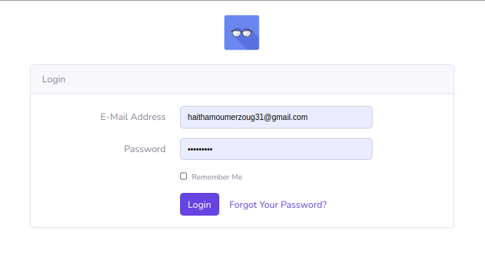
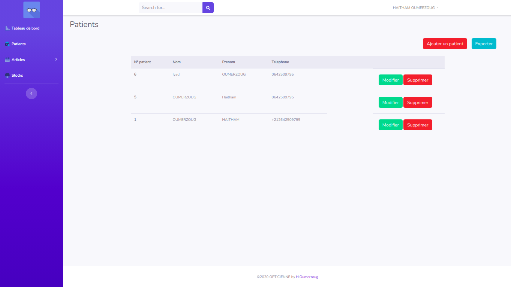
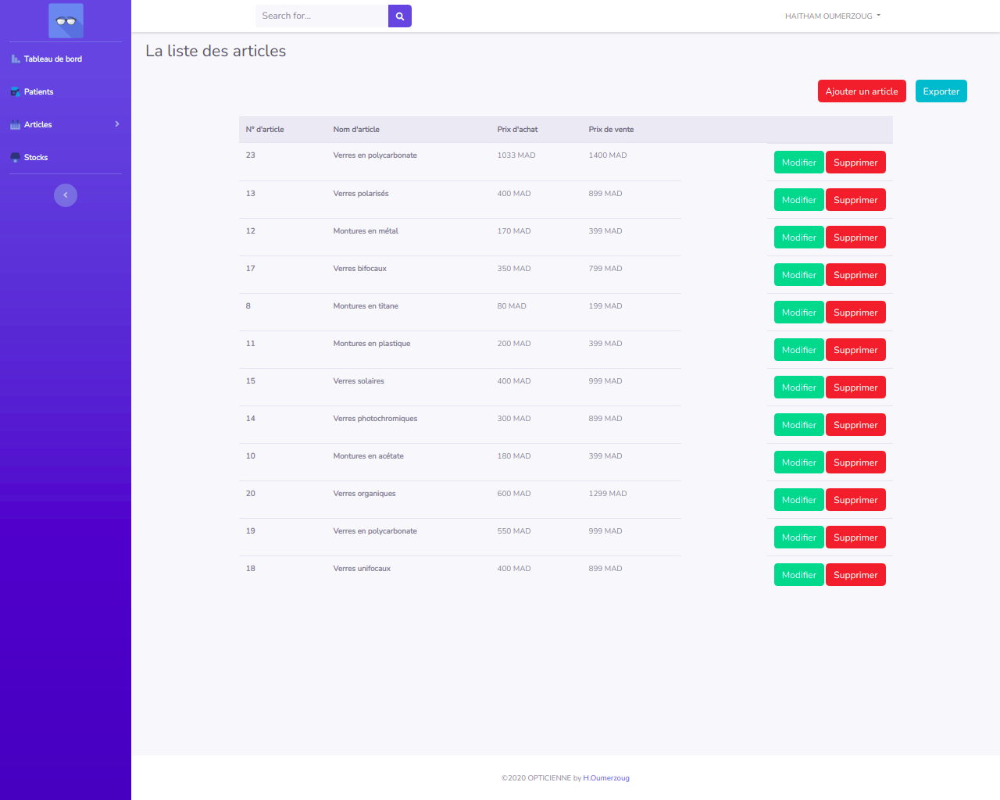
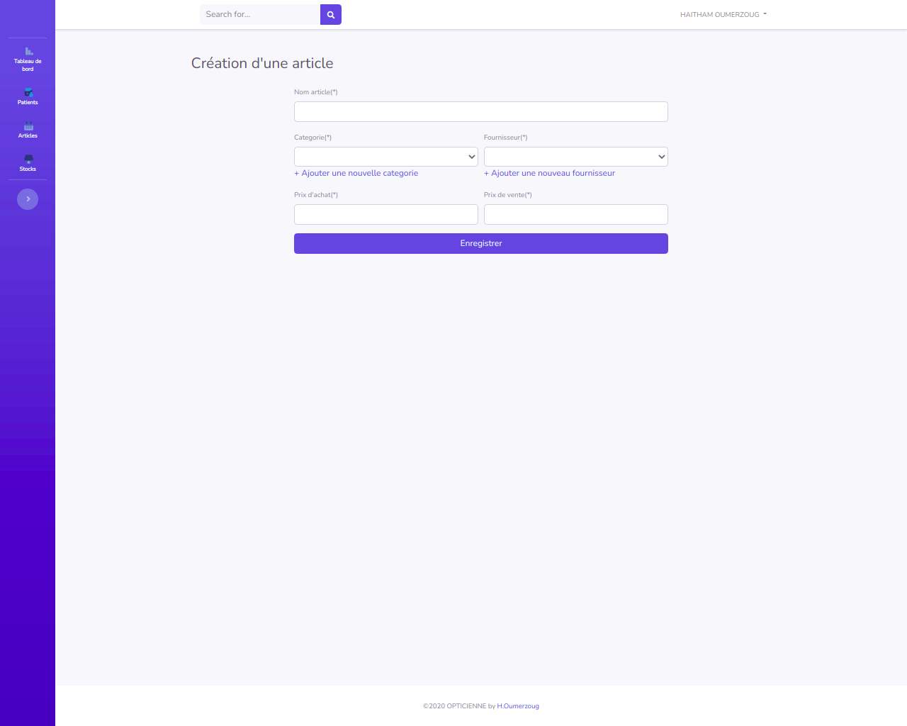
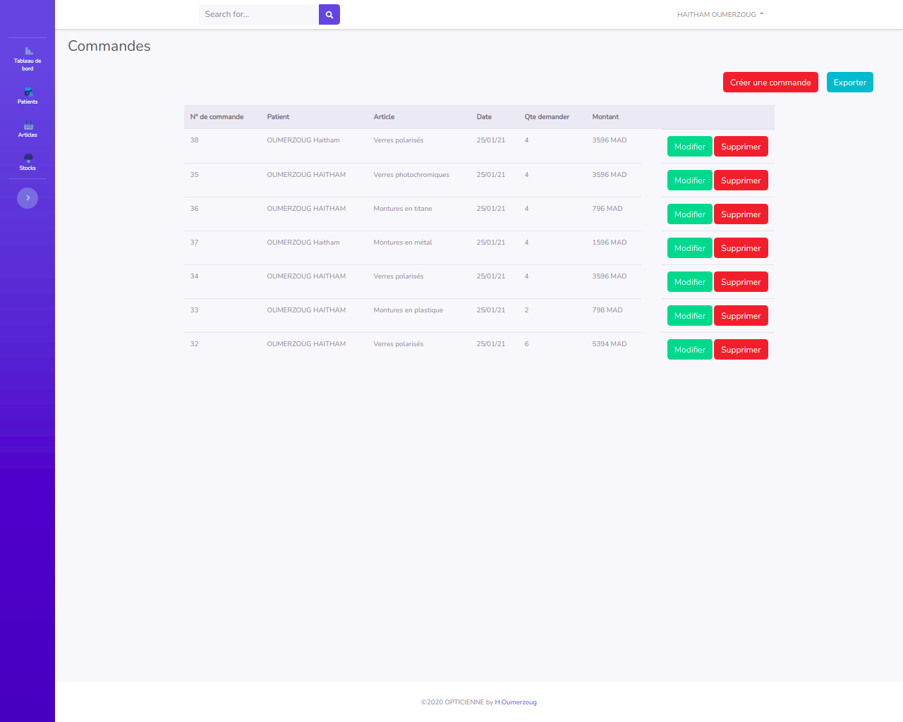
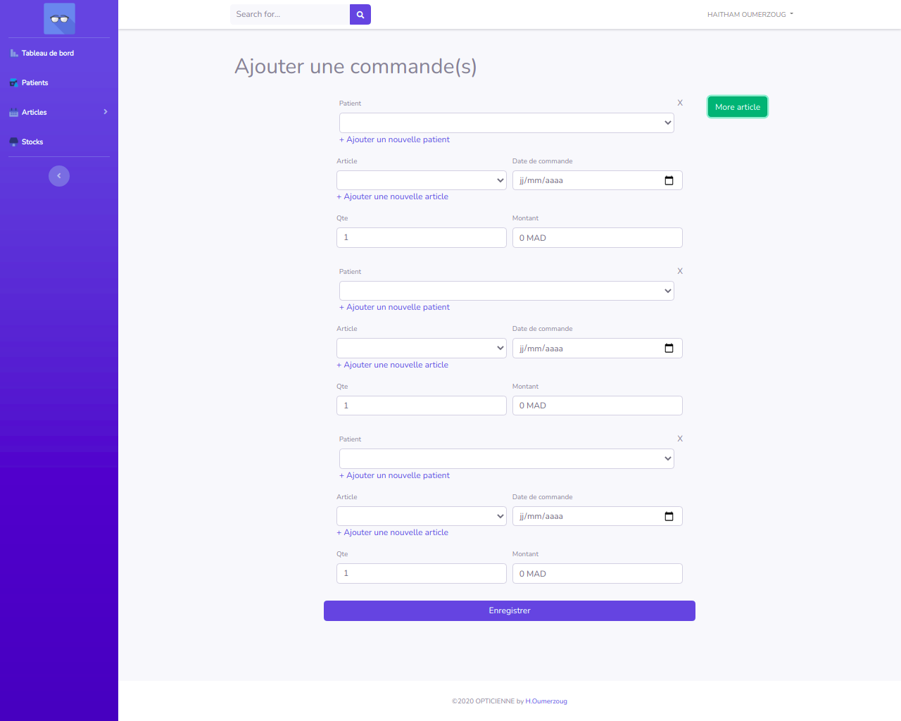

<p align="center"></p>

<p align="center">
<h1 align="center">Opticienne</h1>
<h3 align="center">Application Web en utilisant Laravel & Vue.js</h3>

#### Contenu
* [Introdution](#introduction)
* [Conditions](#conditions)
* [Usage](#usage)
* [Interfaces](#interfaces)
* [Licence](#licence)

## Introduction
Ce projet à but de réaliser une application web pour la géstion commerciale d'une opticienne ,et qui fait ces fonctionnalités :
1. Gestion des commandes patients.
1. Conception et mise en place de la base de données.
1. Gestion de stock.
1. Paramétrage des articles.

## Conditions 
- PHP  >= 7.2.5
- Laravel >= 7.x

## Usage
1. Créer un nouveu projet laravel en tapons cet commande `(Laravel version 7.x)` :
```php 
laravel new nom_de_projet
```
Ou vous pouvez également créer votre projet en émettant le Composer :
```php
composer create-project --prefer-dist laravel/laravel:^7.0 nom_de_projet
```
2. Téléchargez et copiez simplement la le projet [Opticienne](https://github.com/HaithamOumerzoug/Opticienne) dans votre projet.
Ensuite, vous pouvez simplement exécuter votre projet en tapons la commande :
```php 
php artisan serve
```
- Ou vous pouvez installer le projet via la commande :
```git
git clone https://github.com/HaithamOumerzoug/Opticienne-Laravel-Vue.js.git
```
## Interfaces
* ### Login
<p align="left">
  
</p>

* ### Patients
<p align="left">
  
</p>

* ### Articles
<p align="left">
  
</p>

* #### Add Article
<p align="left">
  
</p>

* ### Commands
<p align="left">
  
</p>

* #### Add Commandes
<p align="left">
  
</p>

## License

Ce projet est autorisé selon les termes de la [MIT license](https://opensource.org/licenses/MIT).

Pour plus informations voilà la [documentation du Laravel 7.x](https://laravel.com/docs/7.x/)
